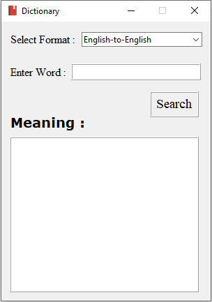

# Dictionary-GUI [](https://forthebadge.com)

[](https://github.com/insanecodes/Dictionary-GUI)
[](https://github.com/insanecodes/Dictionary-GUI/fork)
<br>
A Dictionary GUI App Made Using Python 3.9.0 .
Hope You Will Like It and you can also use the code to make your own version.

>### To Run, simply double click on the **dictionary_gui.exe**.
## Requirements
1.  PyDictionary
2.  English-to-Hindi
3.  tkinter

---

### Installing The PyDictionary Module:
* For Linux: Open Terminal then type ```pip3 install PyDictionary```
* For Windows: Open CMD, then type ```pip install PyDictionary```

### Installing The English-to-Hindi Module:
* For Linux: Open Terminal then type ```pip3 install English-to-Hindi```
* For Windows: Open CMD, then type ```pip install English-to-Hindi```

---
## Demo


<div align="center">

### Show some ❤️ by starring the repository!

</div>
